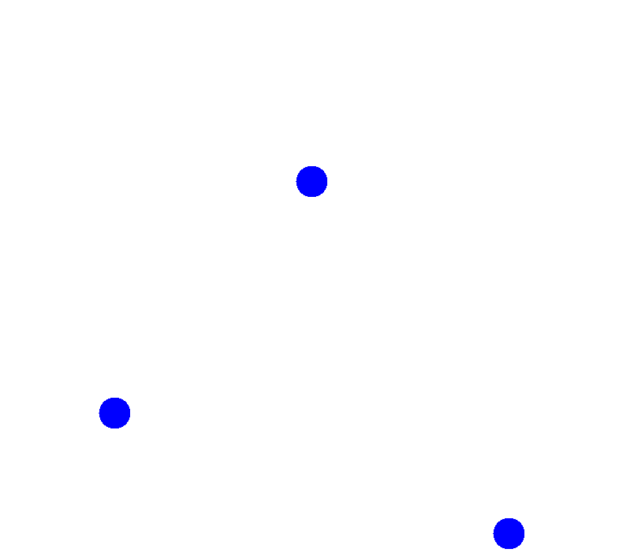

# Bouncing Ball Simulator

---

# Descripción del Proyecto

El **Bouncing Ball Simulator** es una aplicación gráfica que simula el comportamiento de bolas rebotando. Esta aplicación está diseñada para enseñar conceptos básicos de física y programación en Java. La simulación incluye características como la caída libre y la colisión elástica de las bolas.

# Clases y Estructura del Proyecto

El proyecto está organizado de la siguiente manera:

- **BouncingBall**: Define la estructura de la bola con sus atributos.
- **BouncingBallSimulator**: Maneja la simulación del movimiento de la bola usando la física.
- **Physics**: Contiene los métodos para calcular la física del movimiento de la bola.
- **Coordinates**: Define las coordenadas y métodos para convertirlas.
- **BouncingBallDisplay**: Interfaz que define los métodos para dibujar y manejar eventos de la bola.
- **SwingBouncingBallDisplay**: Implementa la interfaz `BouncingBallDisplay` y maneja la visualización y eventos de la bola.
- **BouncingBallPresenter**: Controlador que maneja la simulación y la interacción entre la vista y el modelo.
- **MainFrame**: Configura la ventana principal de la aplicación.
- **Main**: Clase principal que inicia la aplicación.

# Conclusión

El **Bouncing Ball Simulator** es una herramienta educativa y entretenida que proporciona una comprensión práctica de los principios físicos y las técnicas de programación en Java. La implementación de la simulación y la visualización gráfica ayuda a visualizar conceptos complejos de manera intuitiva y atractiva. Además, el código bien estructurado y modular facilita la extensión y personalización del proyecto para satisfacer necesidades específicas o explorar nuevas ideas.
